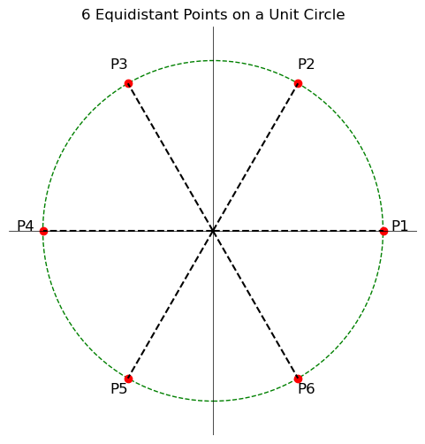
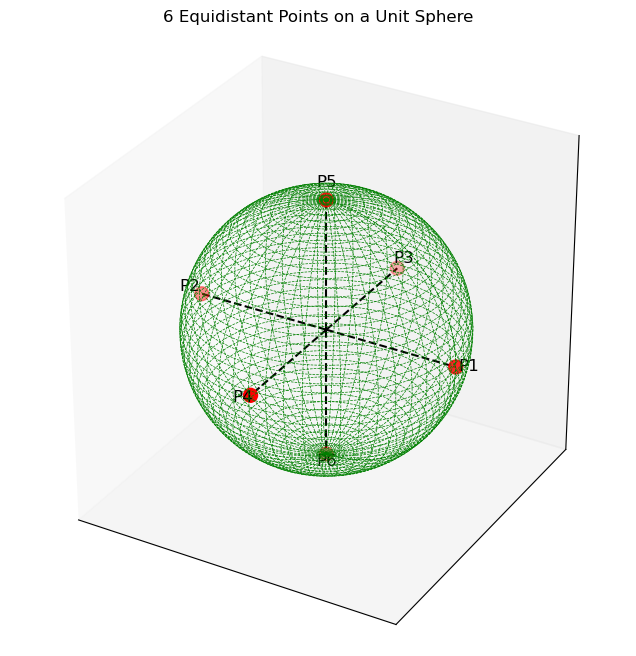

## The curse of dimensionality
The curse of dimensionality arises from the fact that at higher dimensions, the features space becomes increasingly sparse **for a fixed-size training set**. Because of this, many machine learning algorithms that work fine in low dimensional features space have their performance degraded severely in the features space in higher dimensions. Due to the sparsity, the entire training set only occupies a microscopic fraction of the features space. 

To quote Prof. Pedro Domingos of University of Washington in his excellent article: [A Few Useful Things to Know About Machine Learning](https://homes.cs.washington.edu/%7Epedrod/papers/cacm12.pdf):

>Even with a moderate features dimension of 100 and a huge training set of a trillion examples, the latter covers only a fraction of about $10^{-18}$ of the input space.

Let's try to understand this a bit more with a few simple mathematical intuitions:

**Intuition 1:** Consider a pizza with a rather odd slice which cuts it in two concentric circles. Let's also assume that the size of the pizza is significantly larger than the typical large size pizza.  For the sake of assigning some numbers, let's say that its radius is 1' whereas the the slice has a radius of 1/2'.

Let's calculate how much area is sliced out by the smaller circle:
$$A = \pi * r^{2}$$
$$\implies A_{large} = \pi * 1 * 1 = \pi \quad sq.ft$$ and, 
$$A_{small} = \pi * \frac{1}{2} * \frac{1}{2} = \frac{\pi}{4} \quad sq.ft$$
Remaining area = $A_{large} - A_{small} = \frac{3\pi}{4} \quad sq.ft$ . This means only 25% area is sliced out by the smaller pizza whereas 75% of the crust is still present in the remaining pizza.

Let's extrapolate this example to 3 dimensions to a sphere of a unit radius. If a smaller sphere of radius one-half is carved out. We can compute the volume remaining in the sphere in a way similar to the pizza example:

Remaining volume = $V_{large} - V_{small} = \frac{4}{3} * \pi * 1^{3} - \frac{4}{3} * \pi * (\frac{1}{2})^{3} = \frac{4}{3} * \pi * \frac{7}{8}$ 
We can see that only 12.5% volume of the sphere is carved out and 87.5% of the volume is still there.

This can be generalized to higher dimensions &ndash; as we increase the dimensionality, the volume of a hypersphere is concentrated more and more in its outer skin. If a fixed-size training set is uniformly distributed in an $n$-dimensional hypersphere, most of them will be closer to the edge of the hypersphere and far apart from each other.

**Intuition 2:** Consider six points lying on the circumference of a circle of unit radius such that they are equidistant from each other. By simple geometry, you can find that the angle between any two adjacent points is 60 degrees.

However, if those same 6 points located on the outer surface of a unit sphere, the angle between the adjacent point increases from 60 degrees to 90 degrees. 

This can be extrapolated to higher dimensions and can be inducted that the angle between adjacent points will keep on increasing.

From Prof. Pedro Domingos &ndash; Higher dimensions break down our intuitions because they are very difficult to understand. Naively, one might think that gathering more features never hurts, since at worst they provide no new information about the class. But in fact their benefits may be outweighed by the curse of dimensionality.

> **A word of caution:** Although distance as a metric works well in the above intuition qualitatively, and is traditionally used in $k$ dimensions ($k \le 3$), it should be avoided in the feature spaces with higher values of $k$ ($k \gt 3$). Because of this, algorithms which use L1 or L2 norms like K-nearest neighbors become ill-defined in higher dimensions. The article by Aggarwal et al., "[On the Surprising Behavior of Distance Metrics in Higher Dimensional Space](https://bib.dbvis.de/uploadedFiles/155.pdf)" discusses this in great detail.

## Principal Component Analysis
It's a tool for providing a low-dimensional representation of the dataset without losing much of the information. By information we meant, it tries to capture as much variation in the data as possible.

The new features can be projected in a much smaller space whose axes are called principal components. These axes are orthogonal to each other and their direction can be interpreted as the direction of maximum variance. The orthogonality between the principal components ensures no correlation between each other. 

PCA is very sensitive to the data scaling. Features with larger scales or variances will completely dominate the PCA results. PCA directions will be biased towards these features, which will potentially lead to the incorrect representations of the structure of the data. It is therefore highly recommended to standardize the data first before applying it. 

The overall flow for applying the PCA for dimensionality reduction can be summarized by following steps:
1. Normalize the dataset containing $d$ features with zero mean and unit standard deviation 
2. Construct the covariance matrix
3. Compute the eigenvectors and corresponding eigenvalues of this matrix
4. Sort the eigenvalues in the decreasing order
5. Select $k$ ($\lt d$) eigenvectors that correspond to the largest eigenvalues, these eigenvectors will form the basis of our new feature space. In other words, the set of these $k$ eigenvectors is the $k$ principal components of our dataset
6. Construct a new matrix from these $k$ eigenvectors
7. The last thing to do it to project our original dataset in the $d$ dimensional feature space to this new feature space with the $k$ features. This will be done by a simple matrix multiplication of the original dataset with the matrix we constructed in the last step
> NOTE: Refer to the notebook for more details

## Linear discriminant analysis
LDA is a similar technique as PCA for dimensionality reduction. However, one big difference between LDA and PCA is LDA takes class information into account to find the feature subspace which optimizes the class separability. In other words, unlike with PCA, LDA performs the data compression in a supervised learning setting. 

The overall flow for LDA can also be summarized in a series of steps:
1. Standardize the dataset containing $d$ features
2. For each class, compute the mean for each feature. This will be a $d$-dimensional vector containing the averages of each of the features after the dataset is filtered by each class
3. Construct two matrices &ndash; $S_{W}$ and $S_{B}$ &ndash; containing the information of the data-interactions within each class as well as between other classes respectively (will be discussed more shortly)
4. Compute eigenvectors and eigenvalues of the matrix &ndash; $S_{W}^{-1} \cdot S_{B}$
5. Rest of the steps are exactly the same as PCA &ndash; sort the eigenvalues -> choose $k$ eigenvectors corresponding to the $k$ largest eigenvalues -> project the original dataset in $d$-dimensional feature space to the new feature subspace with $k$ features after creating the projection matrix from eigenvectors

Step 3 above is a bit different than the PCA and requires further explanation:
**TODO**

## References
- https://stats.stackexchange.com/questions/451027/mathematical-demonstration-of-the-distance-concentration-in-high-dimensions
- https://homes.cs.washington.edu/%7Epedrod/papers/cacm12.pdf
- https://mathoverflow.net/questions/128786/history-of-the-high-dimensional-volume-paradox/128881#128881
- https://stats.stackexchange.com/questions/99171/why-is-euclidean-distance-not-a-good-metric-in-high-dimensions

